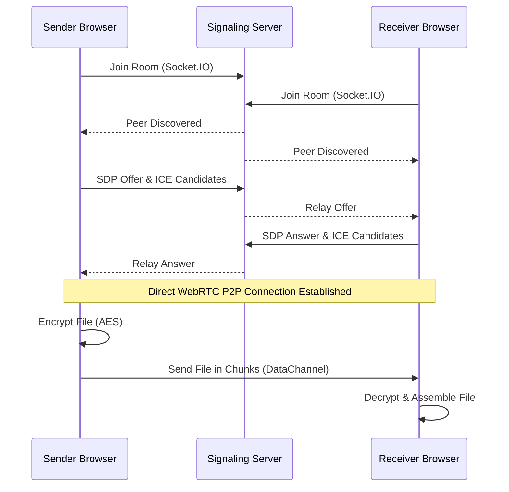

# WeMesh

WeMesh is a fully decentralized file sharing and real-time chat application built using WebRTC, Socket.IO, and React. It enables secure, direct peer-to-peer (P2P) communication without any central server for data transfer.

## Features

| Feature | Description |
|---|---|
| **Pure P2P Architecture** | No middle servers for transferring files or messages. All communication is browser-to-browser. |
| **End-to-End Encryption** | Files are encrypted using AES (via CryptoJS) before being sent. |
| **Room-Based Access** | Create rooms with custom IDs and limited to 2, 5, or 10 users. |
| **Real-Time Chat & Transfer** | Live messaging system synced across peers alongside file sending. |
| **Zero Server Limits** | Since data bypasses servers completely, there are no artificial file size limits. |

## How It Works



## Tech Stack

| Layer | Technologies |
|---|---|
| **Frontend** | React, WebRTC, Socket.IO Client, CryptoJS |
| **Backend** | Node.js, Socket.IO (for signaling only) |

## Getting Started

### Prerequisites
- Node.js (v16 or above)
- npm

### Installation & Setup

1. **Clone the Repository**
   ```bash
   git clone https://github.com/ksrahul23/WeMesh.git
   cd Decentralized_File_Sharing
   ```

2. **Start the Signaling Server**
   ```bash
   cd server
   npm install
   node server.js
   ```
   *Runs on http://localhost:5000*

3. **Start the Client Application**
   ```bash
   cd ../client
   npm install
   npm start
   ```
   *Runs on http://localhost:3000*

## Deployment

**Backend**
- Deploy the `/server` folder to any Node.js hosting provider.
- Update the server URL in `client/src/hooks/useWebRTC.js` to point to the deployed signaling server URL.

**Frontend**
- Update the `homepage` field in `client/package.json` with your GitHub Pages URL.
- Deploy using:
  ```bash
  cd client
  npm run deploy
  ```

## License

This project is licensed under the MIT License.
